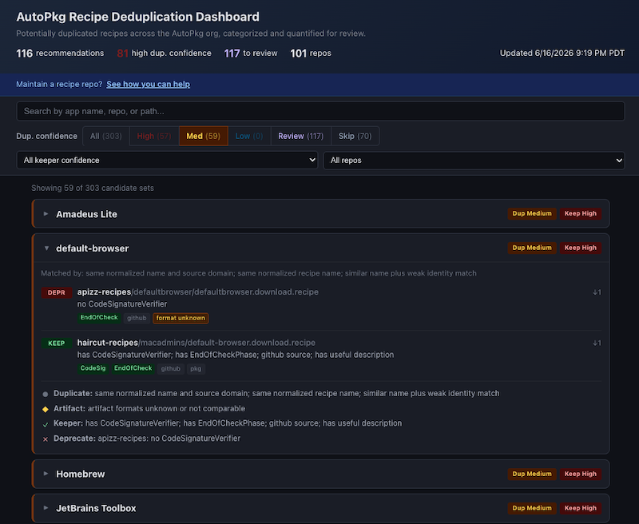

# AutoPkg Dupe Tracker

Finds and helps resolve redundant recipes across the [AutoPkg](https://github.com/autopkg) GitHub organization.

[](https://homebysix.github.io/autopkg-dupe-tracker/)

**[View the dashboard](https://homebysix.github.io/autopkg-dupe-tracker/)**

[](https://github.com/homebysix/autopkg-dupe-tracker/actions/workflows/refresh.yml)

## What this does

Multiple AutoPkg recipe repos often contain download recipes for the same application. This project finds those duplicates across the AutoPkg org and recommends which recipe to keep as the long-term parent, which to deprecate or reparent, and which sets still need a human to look closer. The recommendations are deterministic — they come from recipe quality signals and explicit overrides, not from an LLM or any other stochastic scorer.

The output is advisory. It does not open PRs, edit recipe repos, or remove recipes. It produces a static dashboard plus the JSON behind it from a local cohort of AutoPkg repos.

It keeps two decisions separate:

1. **Duplicate detection** — are these recipes trying to serve the same role?
2. **Keeper selection** — if so, which recipe is the best parent to keep?

### Duplicate detection

The tool scans download recipes and groups the ones that appear to target the same software. Stronger matches come from shared upstream sources: the same GitHub release repo, the same Sparkle appcast, a normalized download URL, a code signing authority plus normalized name, or a source domain plus normalized name.

Name-only and fuzzy name matches are treated cautiously. They can still form a candidate set, but they produce lower duplicate confidence and usually route to `review` rather than an automatic deprecation recommendation.

The tool also looks for evidence that similar recipes are *not* actually substitutable. Sets with incompatible artifact formats, or descriptions that signal a fork, enterprise build, portable variant, rebrand, community edition, or other distinct distribution, stay visible but are not treated as simple deprecation candidates.

### Keeper selection

For sets that look substitutable, each member recipe gets a deterministic quality score. The score favors recipes with `CodeSignatureVerifier`, `EndOfCheckPhase`, resilient source providers (especially GitHub releases and Sparkle appcasts), architecture or release/channel input variables, useful descriptions, and dependent child recipes that already rely on the recipe as a parent. Repo-level override metadata can keep a repo from being preferred as a keeper.

Keeper ordering is based on those quality signals first, then repo-level overrides, then `first_commit` for close ties, and finally repo/path identity for anything still tied. Display names only label and sort the dashboard groups — they never choose the keeper. `first_commit` matters because the older recipe is often the established parent when two recipes are otherwise similar, but it is only a tiebreaker and never outweighs a clear quality difference.

## How recipe maintainers can help

If you maintain a recipe repo in the AutoPkg org, check the [dashboard](https://homebysix.github.io/autopkg-dupe-tracker/) and filter by your repo name to see the sets that affect you.

When the dashboard flags one of your recipes for deprecation, you can:

- **Add a `DeprecationWarning`** (or a clear deprecation message) pointing to the recommended keeper.
- **Update `ParentRecipe`** references in downstream recipes to point to the keeper.
- **Reparent or remove the duplicate** once dependents have moved over.

You can also make the recommendations themselves more accurate by making each recipe's intent and quality explicit:

- Add `CodeSignatureVerifier` whenever the downloaded app or package can be verified.
- Add `EndOfCheckPhase` so recipes stop cleanly after determining the latest version.
- Prefer durable upstream providers like `GitHubReleasesInfoProvider` or Sparkle appcasts over brittle scrape/download URLs.
- Use clear `NAME`, `Identifier`, and folder naming so equivalent recipes normalize to the same product name.
- Add a concise description when a recipe is intentionally distinct (enterprise build, fork, portable variant, rebrand, special channel, or architecture-specific distribution).
- Preserve parent/child relationships when a download recipe is the canonical parent for install, pkg, munki, or other child recipes.

If a set is marked `review`, the most useful fixes are usually a more precise source URL or provider, a code signing verifier, or a description that explains why the recipe should stay separate.

## Hosted refreshes

The [refresh workflow](.github/workflows/refresh.yml) is self-contained: it checks out this repo, installs the Python dependencies, runs the tests, clones the AutoPkg org repos, builds the dashboard into `docs/`, and commits the result. GitHub Pages serves `docs/` from the default branch, so the published site updates on each weekly run.

## Run

Build the dashboard from a local cohort of AutoPkg repos:

```bash
python3 dedupe.py \
  --repos-dir ~/Developer/_personal/repo-lasso/repos/autopkg \
  --output-dir docs \
  --override-repos data/override_repos.json \
  --override-sets data/override_sets.json
```

For faster local iteration without git history (skips `first_commit` lookups):

```bash
python3 dedupe.py --repos-dir ~/Developer/_personal/repo-lasso/repos/autopkg --skip-git
```

`generated_at` in the output is run metadata so a published dashboard can be told apart from a stale one. It is not an input to duplicate detection, keeper selection, or ranking.

## Outputs

- `docs/dashboard.json` — ranked structured data.
- `docs/index.html` — the static dashboard.

## Tests

```bash
python3 -m unittest discover -s tests
```

## Disclaimer

These recommendations are produced by automated heuristics and are meant as a starting point for human review. They can be wrong or miss important context. Always read the actual recipes and consider the broader impact before acting on any recommendation.

## Repository structure

```
dedupe.py                Convenience entry point (wraps recipe_dedupe.cli)
recipe_dedupe/           Analysis package
  recipe.py              Scans and parses download recipes
  candidates.py          Groups recipes into candidate duplicate sets
  scoring.py             Scores keepers; assigns duplicate and keeper confidence
  dashboard.py           Renders dashboard.json and index.html
  cli.py, io.py, models.py
scripts/
  clone_repos.sh         Clones the AutoPkg org repos locally
data/
  override_repos.json    Per-repo flags (e.g. never_keep)
  override_sets.json     Per-set exceptions
docs/
  index.html             The dashboard (generated)
  dashboard.json         Dashboard data (generated)
tests/                   Unit tests
```

## License

Apache 2.0 — see [LICENSE](LICENSE).
